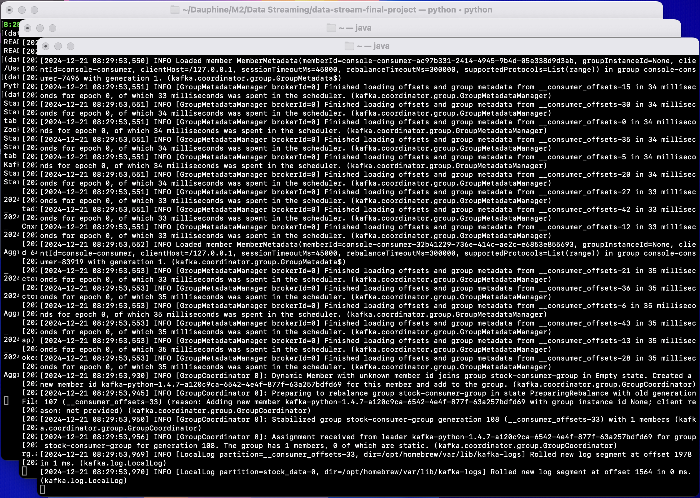

# Final Project (Data Streaming)

## Description

This project streams real time stock data using the Rapid API (Yahoo Finance). The Kafka *Producer* sends the data to the *Consumer* which passes it to a *Sliding Window* script to aggregate the data. 

## Requirements

- MacOS or Linux
- Kafka 3.9.0
- Python 3.11.10 (above versions might pose some problems)
	- python-dotenv
	- kafka-python
	- requests
- RAPID API account
	- enable Yahoo Finance, copy the API-key (X-RapidAPI-Key)
	- Store the key in a **.env** file at the root of the project (cf. **.env.template**)

## How to run 

1. Open the **config.py** file and modify it according to your installation and to what you want to observe (stock_symbol, window length, sliding interval, request interval ...).  
  
2. In the **yahoo_finance_api.py** file, uncomment the part for real-time data and comment the testing line.

2. Open a terminal in the root folder of the project and run :  
```bash
python main.py
```

3. To stop the execution of the program type :  
`
Ctrl+C
`
for each window (zookeeper, kafka, and the main window where the aggregation is displayed)

## Screenshots

- setup and program start-up:

- When pressing enter, you will see 2 popup terminal windows appear on top of this existing window. One if for Zookeeper and one for Kafka:

- To see the part of the program that interests us, you'll just need to switch back to switch back to the original window (without closing the other two):

- In the screenshot above, the code was runing with the testing module (in *yahoo_finance_api.py*) because of requests limits imposed by the api.  
But as you can see, the program will notify you whenever it receives new data from the api and, at a time interval defined by the sliding window, it will show you the aggregated data (here it's only the avg close price of AAPL stock).  
  
Depending on the needs of the user, the observed stock could be changed from AAPL, as well as the time intervals for the sliding window and the data requests, by changing the highlighted values in the screenshot below (from the *config.py* file): 

